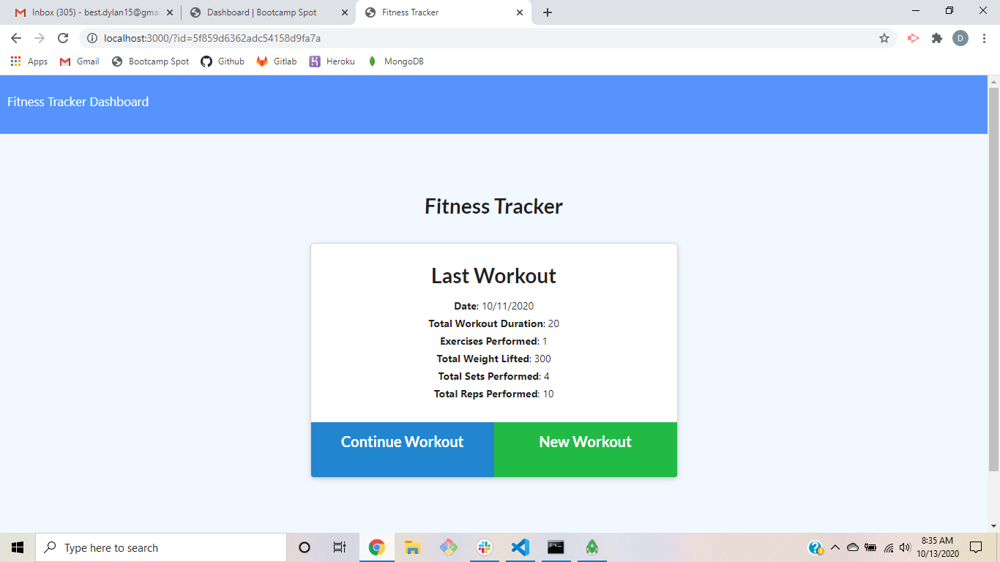

# Fitness-Tracker
This app utilizes an Express server with a MongoDB database to allow the user to create and track daily workouts. It makes multiple API calls using Mongoose to view workouts by date, add workouts, add excercies to workouts, and show weekly stats for workouts. The workout model allows thew workouts to be categorized as either resistance or cardio, and the user may add other information such as weights, reps, sets and duration. This app can function as a simple and accessible workout tracker for the user.

## Built With
- <a href="https://www.npmjs.com/package/express">Express NPM</a>
- <a href="https://www.mongodb.com/">MongoDB</a>
- <a href="https://www.npmjs.com/package/mongoose">Mongoose NPM</a>

## Screenshots

## Live Link
https://warm-spire-59876.herokuapp.com/

## License
Copyright ©2020 Dylan Best

Permission is hereby granted, free of charge, to any person obtaining a copy of this software and associated documentation files (the "Software"), to deal in the Software without restriction, including without limitation the rights to use, copy, modify, merge, publish, distribute, sublicense, and/or sell copies of the Software, and to permit persons to whom the Software is furnished to do so, subject to the following conditions:

The above copyright notice and this permission notice shall be included in all copies or substantial portions of the Software.

THE SOFTWARE IS PROVIDED "AS IS", WITHOUT WARRANTY OF ANY KIND, EXPRESS OR IMPLIED, INCLUDING BUT NOT LIMITED TO THE WARRANTIES OF MERCHANTABILITY, FITNESS FOR A PARTICULAR PURPOSE AND NONINFRINGEMENT. IN NO EVENT SHALL THE AUTHORS OR COPYRIGHT HOLDERS BE LIABLE FOR ANY CLAIM, DAMAGES OR OTHER LIABILITY, WHETHER IN AN ACTION OF CONTRACT, TORT OR OTHERWISE, ARISING FROM, OUT OF OR IN CONNECTION WITH THE SOFTWARE OR THE USE OR OTHER DEALINGS IN THE SOFTWARE.

## Authors
- **Dylan Best** - [dylanbest15](https://github.com/dylanbest15)